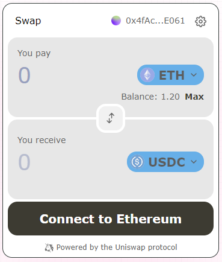

# Uniswap Labs Widgets (Plus)

The `@uniswap/widgets` package is an [npm package](https://www.npmjs.com/package/@uniswap/widgets) of React components used to provide subsets of the Uniswap Protocol functionality in a small and configurable user interface element.

This is an extension version of Uniswap widget that provides importable built-in themes for mania developers.
  

# Uniswap Labs Swap Widget

The Swap Widget bundles the whole swapping experience into a single React component that developers can easily embed in their app with one line of code.

In this version it was updated with additional built-in theme styles that can plugged-in.
 
## Theme Previews
### Default Theme (Light)
 


### Default Theme (Dark)


### Green Theme


### Espresso Theme




### Coal Theme


### Toy Theme


You can customize the theme (colors, fonts, border radius, and more) to match the style of your application. You can also configure your own default token list and optionally set a convenience fee on swaps executed through the widget on your site.

  

## Installation

  

Install the widgets library via `npm` or `yarn`.

  

```js

yarn add @uniswap/widgets

```

```js

npm i --save @uniswap/widgets

```

  

## Documentation

  

- [overview](https://docs.uniswap.org/sdk/widgets/swap-widget)

- [api reference](https://docs.uniswap.org/sdk/widgets/swap-widget/api)

  

## Example Apps

  

Uniswap Labs maintains two demo apps in branches of the [widgets-demo](https://github.com/Uniswap/widgets-demo) repo:

  

- [NextJS](https://github.com/Uniswap/widgets-demo/tree/nextjs)

- [Create React App](https://github.com/Uniswap/widgets-demo/tree/cra)

  

Others have also also released the widget in production to their userbase:

  

- [OpenSea](https://opensea.io/)

- [Friends With Benefits](https://www.fwb.help/)

- [Oasis](https://oasis.app/)

  

## Legal notice

  

Uniswap Labs encourages integrators to evaluate their own regulatory obligations when integrating this widget into their products, including, but not limited to, those related to economic or trade sanctions compliance.